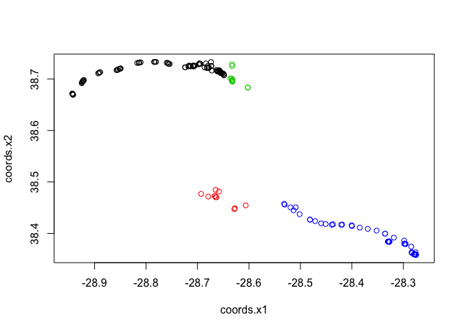

vanderHoop\_Animove
================
Julie van der Hoop
August 23, 2017

Animove Notes - Aug 27 - 9 Sept 2017
====================================

Here are all the packages to install: install.packages(c("moveVis","pbs","dplyr","RStoolbox","move","ggmap","TwoStepCLogit","pbs","dplyr",'lubridate","fdrtool","circular","CircStats"),dependencies = T)

Exercise to import our own data 28 Aug 2017
===========================================

Import sperm whale files over a loop. Import .mat files, convert to R data frame, correct timestamp from MATLAB to R.

Loading Data
------------

``` r
library("move")
```

    ## Loading required package: geosphere

    ## Loading required package: sp

    ## Loading required package: raster

    ## Loading required package: rgdal

    ## rgdal: version: 1.2-8, (SVN revision 663)
    ##  Geospatial Data Abstraction Library extensions to R successfully loaded
    ##  Loaded GDAL runtime: GDAL 2.1.3, released 2017/20/01
    ##  Path to GDAL shared files: /Library/Frameworks/R.framework/Versions/3.4/Resources/library/rgdal/gdal
    ##  Loaded PROJ.4 runtime: Rel. 4.9.3, 15 August 2016, [PJ_VERSION: 493]
    ##  Path to PROJ.4 shared files: /Library/Frameworks/R.framework/Versions/3.4/Resources/library/rgdal/proj
    ##  Linking to sp version: 1.2-4

``` r
library('R.matlab')
```

    ## R.matlab v3.6.1 (2016-10-19) successfully loaded. See ?R.matlab for help.

    ## 
    ## Attaching package: 'R.matlab'

    ## The following objects are masked from 'package:base':
    ## 
    ##     getOption, isOpen

``` r
setwd("/Users/julievanderhoop/Documents/R/Animove/Animove/")

mymoveobjects<-list()
# dtagfile <- readMat('./data/sw17_193atrk.mat')
myfilenames<-c("./data/sw17_193atrk.mat","./data/sw17_196atrk.mat","./data/sw17_204atrk.mat","./data/sw17_225atrk.mat")
for(i in myfilenames){
dtagfile <- readMat(i)
# convert into a data frame
dtagfile$timestamp <- as.POSIXct((dtagfile$t - 719529)*86400, origin = "1970-01-01 00:00:00", tz = "UTC",format ="%Y-%m-%d %H:%M:%S")
dtagfile1 <- as.data.frame(dtagfile)
# convert MATLAB time time
dtagimport <- move(x=dtagfile1$lon,y=dtagfile1$lat,
                  time=dtagfile1$timestamp,
                  data=dtagfile1,proj=CRS("+proj=longlat"),
                  animal="sw17_193a", sensor="gps")

mymoveobjects[[i]]<-dtagimport
}
```

    ## Warning in .local(x, y, time, data, proj, ...): There were NA locations
    ## detected and omitted. Currently they are not stored in unusedrecords

    ## Warning in .local(x, y, time, data, proj, ...): There were NA locations
    ## detected and omitted. Currently they are not stored in unusedrecords

    ## Warning in .local(x, y, time, data, proj, ...): There were NA locations
    ## detected and omitted. Currently they are not stored in unusedrecords

    ## Warning in .local(x, y, time, data, proj, ...): There were NA locations
    ## detected and omitted. Currently they are not stored in unusedrecords

Stack move objects
------------------

``` r
mymovestack <- moveStack(mymoveobjects, forceTz="UTC")
```

    ## Warning in .local(x, ...): Detected duplicated names. Renamed the
    ## duplicated individuals accordingly.

Plotting the data
-----------------

Regular plot

``` r
plot(mymovestack)
```



Note that the `echo = FALSE` parameter was added to the code chunk to prevent printing of the R code that generated the plot.
